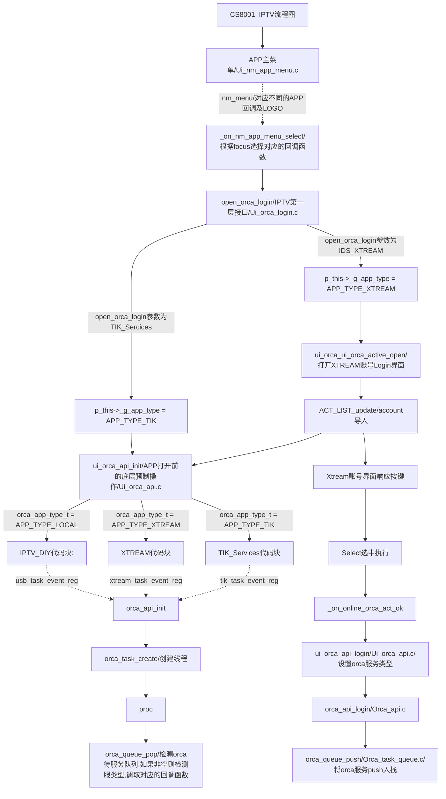

#### SDK升级注意事项
>更新标注：第一次更新-2021年7月21日
>更新标注：第二次更新-2021年8月2日
##### 重要说明-关于编译cbp
```
  //公版SDK虽然带了天气预报和dvbfinder,这两个func已经失效并停止维护，不需编译进来。dvbfinder为扫二维码获取biss key的APP支持.
  
  //公版默认不支持IPTV，所以为了支持IPTV DIY和M3u8需要包含下行
  <Add directory='&quot;${PROJECT_LOC}\prj\dvbs\vendace\network\iptv&quot;' />

  //公版默认不支持xtream，为了支持xtream需包含这些路劲
  <Add directory='&quot;${PROJECT_LOC}\prj\dvbs\vendace\network\orca\ui&quot;' />
  <Add directory='&quot;${PROJECT_LOC}\prj\dvbs\vendace\network\orca\ap&quot;' />
  <Add directory='&quot;${PROJECT_LOC}\prj\dvbs\vendace\network\orca\api&quot;' />  <Add directory='&quot;${PROJECT_LOC}\prj\dvbs\vendace\network\orca\data&quot;' />
  <Add directory='&quot;${PROJECT_LOC}\prj\dvbs\vendace\network\cJSON&quot;' />

  //为了支持我司的cccam功能，需要使用我司自由的iks、patch已经公版不在使用的OpenSSL协议
  //需要包含下列相关的目录、文件、库
  <Add directory='&quot;${PROJECT_LOC}\inc\kware\network\openssl&quot;' />
  <Add directory='&quot;${PROJECT_LOC}\inc\kware\network&quot;' />

  <Add library="openssla" />
  <Add library="opensslb" />

  <Add library="iks" />
  <Add library="patch" />

  <Add directory='&quot;${PROJECT_LOC}\lib\lib_kware\mips4k\lib_64M&quot;' />

  <Unit filename="..\..\..\..\..\..\..\inc\kware\network\openssl\des_cam.h" />
  <Unit filename="..\..\..\..\..\..\..\inc\kware\network\openssl\e_os2.h" />
  <Unit filename="..\..\..\..\..\..\..\inc\kware\network\openssl\opensslconf.h" />

  <Unit filename="..\..\..\..\..\..\..\prj\dvbs\vendace\ap\des.c">
  <Option compilerVar="CC" />
  </Unit>
  <Unit filename="..\..\..\..\..\..\..\prj\dvbs\vendace\ap\des.h" />

  //其他需要额外包含
  <Unit filename="..\..\..\..\..\..\..\prj\dvbs\vendace\ui\ui_seca.c">
            <Option compilerVar="CC" />
  </Unit>
  <Unit filename="..\..\..\..\..\..\..\prj\dvbs\vendace\ui\ui_seca.h" />
  <Unit filename="..\..\..\..\..\..\..\prj\dvbs\vendace\ui\ui_irdeto.c">
	    <Option compilerVar="CC" />
  </Unit>
  <Unit filename="..\..\..\..\..\..\..\prj\dvbs\vendace\ui\ui_irdeto.h" />
  <Unit filename="..\..\..\..\..\..\..\prj\dvbs\vendace\ui\ui_card_sharing.c">
	    <Option compilerVar="CC" />
  </Unit>
  <Unit filename="..\..\..\..\..\..\..\prj\dvbs\vendace\ui\ui_card_sharing.h" />
  <Unit filename="..\..\..\..\..\..\..\prj\dvbs\vendace\ui\ui_matrixcam.c">
	    <Option compilerVar="CC" />
  </Unit>
  <Unit filename="..\..\..\..\..\..\..\prj\dvbs\vendace\ui\ui_matrixcam.h" />
  <Unit filename="..\..\..\..\..\..\..\prj\dvbs\vendace\ui\ui_cryptoworks.c">
	    <Option compilerVar="CC" />
  </Unit>
  <Unit filename="..\..\..\..\..\..\..\prj\dvbs\vendace\ui\ui_cryptoworks.h" />
  <Unit filename="..\..\..\..\..\..\..\prj\dvbs\vendace\ui\ui_drecrypt.c">
	    <Option compilerVar="CC" />
  </Unit>
  <Unit filename="..\..\..\..\..\..\..\prj\dvbs\vendace\ui\ui_drecrypt.h" />
  <Unit filename="..\..\..\..\..\..\..\prj\dvbs\vendace\ui\ui_card_sharing.c">
	    <Option compilerVar="CC" />
  </Unit>
  <Unit filename="..\..\..\..\..\..\..\prj\dvbs\vendace\ui\ui_card_sharing.h" />
  <Unit filename="..\..\..\..\..\.\prj\dvbs\vendace\ui\ui_viaccess.c">
	    <Option compilerVar="CC" />
  </Unit>
  <Unit filename="..\..\..\..\..\..\..\prj\dvbs\vendace\ui\ui_viaccess.h" />
  
```
##### 1. 网络升级
- 1.1 代码块标识：B21071901
- 1.2 相关文件
```
  //调用检测func
  \prj\dvbs\vendace\network\connect\ui_network_api.c

  //主体func的实现：自动检测，文件解析等
  \prj\dvbs\vendace\network\net_upgrade\ui_net_upg_api.c
  \prj\dvbs\vendace\network\net_upgrade\ui_upgrade_by_network.c
  \prj\dvbs\vendace\network\net_upgrade\ui_network_upgrade.c
```
##### 2.YouTube快捷键打开
- 2.1代码块标识：B21071902
- 2.2 相关文件
```
  //快捷打开的实现func
  \prj\dvbs\vendace\network\connect\ui_network_config_wifi.c

  //默认国家为泰国
  \prj\dvbs\vendace\network\netmedias\youtube\dp_youtube.cpp
```
##### 3.YouTube自动连续播放
- 3.1功能对应宏定义：
    - YOUTUBE_AUTO_PLAY(杜工写的代码)
    - Y2B_AUTO_VIRTUAL_KEY（吴桢通过虚拟按键实现代码，此实现代码还有较大优化空间）
- 3.2 相关文件
```
  //杜工
  //是否拿到下一条url message定义
  \prj\dvbs\vendace\network\inc\ui_video_player.h
  //API接口实现
  \prj\dvbs\vendace\network\misc\ui_video_player.c
  \prj\dvbs\vendace\network\netmedias\ui_nm_comm_form.c
  \prj\dvbs\vendace\network\netmedias\ui_nm_comm_content.c

  //吴桢
  //播放state获取等
  \prj\dvbs\vendace\network\misc\ui_video_c.c
  \prj\dvbs\vendace\network\misc\ui_video_player.c
  \prj\dvbs\vendace\network\netmedias\ui_nm_comm_form.c
  \prj\dvbs\vendace\network\netmedias\ui_nm_comm_content.c
```

##### 4.YouTube search历史记录
- 4.1代码块标识：B21071904
- 4.2 相关文件
```
  //message define
  \prj\dvbs\vendace\network\netmedias\ui_nm_comm_content.h

  //YouTube search func
  \prj\dvbs\vendace\network\netmedias\ui_nm_comm_form.c
```

##### 5.M3U8 player
- 5.1代码块标识：B21071903
- 5.2 相关文件
```
  //M3U8 file download func
  \prj\dvbs\vendace\network\netmedias\youtube\ui_nm_youtube.c

  //默认国家为泰国
  \prj\dvbs\vendace\network\netmedias\youtube\dp_youtube.cpp
```
##### 6.CCCAM
- 6.1代码块标识：B21071906
- 6.2相关文件
```
  //功能主体
  \prj\dvbs\vendace\network\net_cccam 整个目录

  //因为ssdata数据生成工具已在多年前处于异常状态，需要的开发平台又难以装配
  //只能在不对应生成新bin的情况下维护cccam功能，所以把旧的ccfg位置保留但不使用，在新的空白区放置ccfg
  \prj\dvbs\vendace\sysstatus\sys_status.h

  //+B21071906
  s_client  ccfg_old;
  //-B21071906

  // + B113462
  #if defined(SUPPORT_TS_DELAY) || defined(SUPPORT_TS_DELAY_V2)
  delay_set_t delay_set;
  #endif
  //+B21071906
  s_client  ccfg;
  //-B21071906


```
##### 8.IPTV ORCA工作流程图

##### 9.TIK Service 功能新增说明
-  2.1 功能对应宏定义：TIK_SERVICES_SUPPORT
-  2.2 代码块标识：B21071905
-  2.3 相关文件
```
  //UI主体功能实现
  add file \prj\dvbs\vendace\network\orca\ui\ui_orca_tik.c

  //功能主体实现，回调函数触发
  add file\prj\dvbs\vendace\network\orca\ap\xtream\tik_task_event_proc.c

  //功能初始化时进行对应的init及退出时进行deinit，回调注册
  \prj\dvbs\vendace\network\orca\ui\ui_orca_api.c
  \prj\dvbs\vendace\network\orca\ui\ui_orca_api.c

  //不同tik服务接口的type define
  \prj\dvbs\vendace\network\orca\ap\orca_task.h

  //节目解析，调用接口tik_data_parse(u8 * p_buf, u32 buf_len,u8 *p, u32 max_left_buf)
  \prj\dvbs\vendace\network\orca\ap\usb\usb_data.c

  //Ui入口
  \prj\dvbs\vendace\network\netmedias\ui_nm_app_menu.c
```


```
//登录应用前进行内存分配
void orca_api_login(u8 *p_in, u32 mask, u32 param)
{
  event_orca_t  evt = {EVT_MAX};
  u32          addr = 0;

  if(SYS_GET_BIT(mask, ORCA_LOGIN_MASK0_AVOID_MEDIA))
  {
    addr += (AV_BUFFER_SIZE / MBYTES) * MBYTES - YOUTUBE_DECODE_SIZE;

    param = mem_mgr_require_block(BLOCK_AV_BUFFER, SYS_MODULE_GDI);
    mem_mgr_release_block(BLOCK_AV_BUFFER);

    addr += param;
  }
  else
  {
    addr = mem_mgr_require_block(BLOCK_AV_BUFFER, SYS_MODULE_GDI);
    mem_mgr_release_block(BLOCK_AV_BUFFER);
  }
  
  evt.type = EVT_ORCA_LOGIN;
  
  evt.context = (u32)ott_strdup(p_in);
  
  evt.para1 = addr;
  evt.para2 = param;
  mem_mgr_release_block(BLOCK_AV_BUFFER);

  orca_queue_push(&evt);
}
```

##### 二、7寸寻星仪SDK升级

##### 1.编译脚本对比B4HD的差异
```
  \config_prj\core\core_ap_mdl_symphony\core_ap_mdl\core_ap_mdl.cbp
  + <Add option="-DSTAR_FINDER" />
  \config_prj\core\core_symphony\core_ap_mdl\core_ap_mdl.cbp
  + <Add option="-DSTAR_FINDER" />
```

##### 2.寻星仪私有代码块，但B4HD包含无害；
 代码块标识：B21072101
```
  //DVBS类型切换设置为硬件切换，加快了TP锁定的速度
  \src\mdl\services\nim_ctrl_svc\nim_ctrl_svc.c

  //支持泰国特殊参数高频头
  \src\util\dvbs_util.c
```
##### 3.寻星仪私有代码块，B4HD不能包含，2套SDK整合时需要启用宏定义。
 代码块标识：B21072102
```
  //trunk\src\ap\playback\ap_playback1.c
  //lock_tuner_1(pb_handle_t *p_handle, play_param_t *p_param, u8 tuner_id)
  #ifdef STAR_FINDER
  //+B21072102
  class_handle_t nc_handle = class_get_handle_by_id(NC_CLASS_ID);
	
  OS_PRINTF("playback lock tuner lock_mode %d tuner_id=%d\n", p_param->lock_mode,tuner_id);
  nc_enable_monitor(nc_handle, TUNER0, FALSE); 
  nc_enable_monitor(nc_handle, TUNER1, FALSE);
  //-B21072102
#endif
```
  
```
  //\src\drv\nim\dm6k\mt_fe_tn_montage_ts6011.c

  //B+21072201 S2+T2需要
		handle->tuner_clock_out			 = 1;     // "0" CLK-output disable,"1" CLK-output enable.
		//B-21072201

  //特殊的按键 
  \prj\dvbs\vendace\fp\fp_manager.c
```
##### 4.代码块 //+B2021072901
```
文件 \src\drv\nim\dvbs\cs8000_sat\mt_fe_sat_tn_montage_rt710.c
代码块 //+B2021072901
寻星仪与机顶盒RT720通信地址设置不同。
```

##### 5.代码块标识 B2021072902
```
优化寻星仪S2/T2节目切换死机问题，S2节目切换到T2时,RT720不应被设置为Standby模式
```
##### 6.代码块 B21072903
```
文件 \src\drv\nim\dm6k\mt_fe_tn_montage_ts6011.c
\prj\dvbs\vendace\ui\ui_manual_search.c 搜台
代码块 B21072903（此代码块标识Combo特殊的signal配置，其他相关source code文件也会看到）
```
##### 7.代码块 B21072903
```
寻星仪的dm6k tuner_clock_out需要设置为enable
文件 \src\ap\playback\ap_playback1.c
代码块 B21072903
文件 \prj\dvbs\vendace\ui\ui_ts_des.c
宏定义标识 STAR_FINDER
```
##### 8.speical set
```
文件 \src\mdl\avctrl\avctrl1.c 
SDK未包含此代码，杜工邮件要去添加
#if 1 //LZ email ask for add
    if(video_mode == AVC_VIDEO_MODE_1080P_50HZ || video_mode == AVC_VIDEO_MODE_1080P_60HZ)
    {
      hal_put_u32((volatile unsigned long *)0xbf5d006c, 0x0a0a0a0a);
    }
    else
    {
      hal_put_u32((volatile unsigned long *)0xbf5d006c, 0x08080808);
    }
#endif  
```
##### 9.B21072101
```
文件 \src\mdl\services\nim_ctrl_svc\nim_ctrl_svc.c
代码块 B21072101
nim DVBS type切换由软件切换改为硬件切换，加快锁TP速递
```
##### 10.对泰国特殊高频头的支持
```
#ifdef STAR_FINDER

文件 \util\dvbs_util.c
代码块 B21072101
mdl层对泰国特殊高频头的支持

文件 \prj\dvbs\vendace\ui\ui_signal_api.c
代码块 B21072101
应用层对泰国特殊高频头的支持

零散小优化的代码块
B21072904

文件 inc\util\dvbt_util.h 
add 泰国选项
\prj\dvbs\vendace\ui\ui_channel_search.c
```
##### 11.应用层CCCAM
```
文件 \prj\dvbs\vendace\ap\ap_twin_port.c
宏定义标识 HTT_CA_SUPPORT
CCCAM 和 NEWCAM功能 接入single step
文件 \prj\dvbs\vendace\ap\ap_twin_port.h
CCCAM 和 NEWCAM define
```
##### 12.寻星仪按键功能
```
文件 prj\dvbs\vendace\ap\ap_uio_impl.c
宏定义标识 STAR_FINDER
寻星仪按键功能

static void _load_key_data(u16 *ir_usr_code)   按键bin文件load
```
##### 13.OTA
```
文件 \prj\dvbs\vendace\ota\htt_dbc.c
\prj\dvbs\vendace\ota\ap_htt_ota.c 
宏定义标识 STAR_FINDER
Maincode OTA Model 标识
```
##### 14.注册机制
```
\prj\dvbs\vendace\ui\ui_time_api.c
\prj\dvbs\vendace\ui\ui_config.h
代码块标识 B21072905
CONVERT_EVENT(TIME_EVT_REGISTER, MSG_USB_REGISTER)
USB注册机制
```
##### 15.寻星仪特殊搜台设置
```
\prj\dvbs\vendace\ui\ui_scan_api.c
代码块标识 B21072906
T2搜台卫星名称自定义
```
##### 16.寻星仪特殊signal显示
```
\prj\dvbs\vendace\ui\ui_comm_root.c
\prj\dvbs\vendace\ui\ui_comm_root.h
代码块标识 B21072907
寻星仪特殊signal显示
```
##### 17.S2 T2节目一键切换
```
\prj\dvbs\vendace\ui\ui_play_api.h
代码块标识 B21072908
S2 T2节目一键切换
```
##### 18.skip
```
\prj\dvbs\vendace\ui\ui_num_play.c
B21072909
future channel skip
```
##### 19.寻星仪T2搜台特殊设置
```
\prj\dvbs\vendace\ui\ui_do_search.c
B21072910
寻星仪T2搜台特殊设置
```
